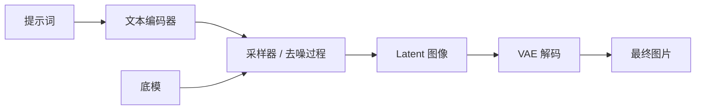

# AI 绘画由哪些部分组成

一句话：AI 绘画不是只有一个模型，而是由模型、编码器、采样流程、提示词和辅助模块共同完成。

## 核心组成

### 底模

底模负责生成能力本身。它决定图片风格、知识范围、分辨率习惯和生态兼容性。

### 文本编码器

文本编码器负责把提示词变成模型能理解的数字表示。不同模型可能使用不同文本编码器，例如 CLIP、T5、Qwen 系编码器等。

如果文本编码器缺失或不匹配，模型可能无法正确理解提示词，甚至工作流直接报错。

### VAE

VAE 负责在模型内部的潜空间和人眼可见的图片之间转换。

直观理解：

- 编码：把图片压缩成模型内部能处理的 latent。
- 解码：把 latent 还原成图片。

VAE 不合适时，可能出现颜色发灰、对比度异常、细节不自然等问题。

### 采样器

采样器决定去噪过程怎么走。常见采样器包括 Euler、Euler a、DPM++ 等。

同一个提示词和模型，采样器不同，画面细节、稳定性和随机感都可能不同。

### 调度器

调度器控制每一步去噪时噪声强度如何变化。它经常和采样器一起出现。

初学者可以先使用教程或模型页面推荐的组合，不必一开始逐个穷举。

### Prompt

Prompt 是提示词，告诉模型你想要什么。它通常分为：

- 正向提示词：希望出现的内容。
- 负向提示词：希望减少或避免的内容。

Prompt 不是命令，更像引导。模型不一定完全服从。

### LoRA

LoRA 是小型附加模型，用来给底模增加某种特征，例如角色、画风、服装、构图、材质或动作。

LoRA 需要匹配底模生态，不是所有模型都能通用。

### ControlNet

ControlNet 用于加强控制，例如让图片遵循边缘图、深度图、姿势骨架、线稿或分割图。

它适合解决“构图和姿势不听话”的问题。

### 工作流

工作流是把以上模块连起来的执行流程。在 ComfyUI 里，工作流通常表现为节点图。

同一个模型可以有很多工作流：文生图、图生图、局部重绘、放大修复、参考图控制等。

## 一个最小文生图流程

## 常见误区

- 把 VAE 当作底模下载。VAE 不能单独生成图片。
- 把 LoRA 当作 checkpoint。LoRA 需要挂在底模上使用。
- 以为工作流能解决所有问题。工作流只是流程，模型能力仍然是基础。
- 忽略文本编码器。新模型常常需要特定文本编码器。
